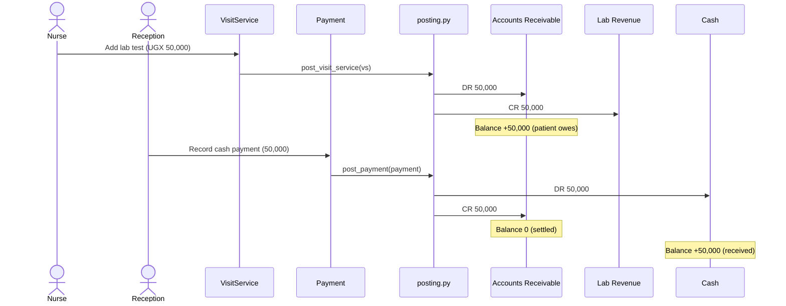
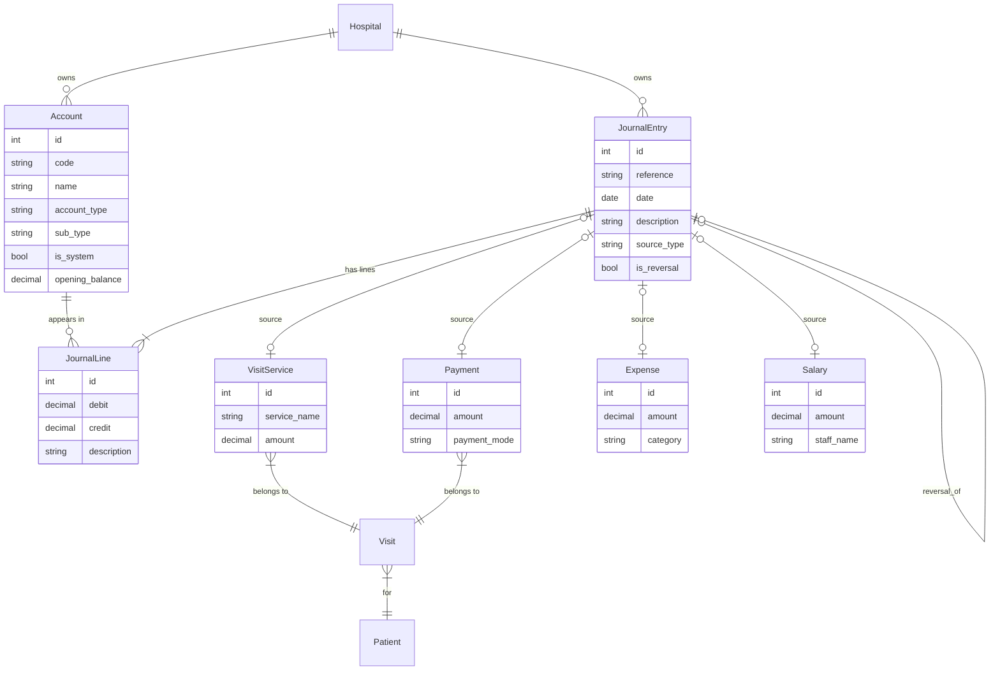
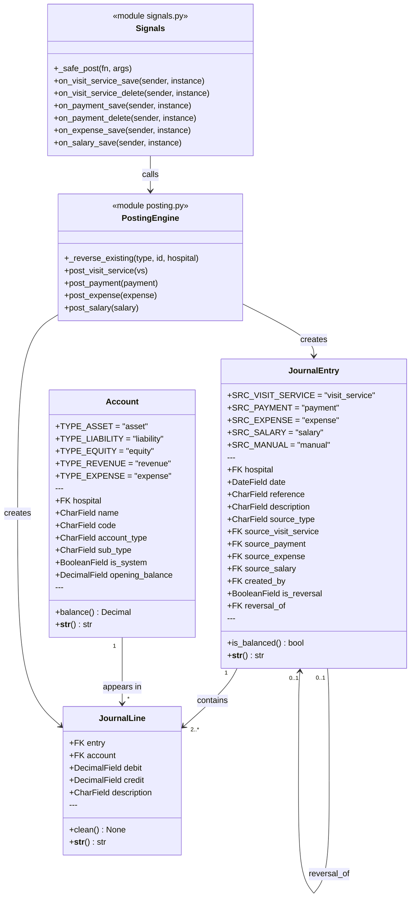

# Finance Module — Technical Reference

> How charges, payments, expenses, and salaries flow through the ledger,
> and how every financial report is derived from a single source of truth.

**Framework:** Django 6.0.3 · **Isolation:** FK-per-hospital (multi-tenant) · **Standard:** Double-Entry Bookkeeping · **Currency:** UGX

---

## Table of Contents

1. [Overview](#1-overview)
2. [Chart of Accounts](#2-chart-of-accounts)
3. [Journal Entries & Lines](#3-journal-entries--lines)
4. [Posting Engine](#4-posting-engine)
5. [Django Signals & Auto-posting](#5-django-signals--auto-posting)
6. [Views & Reports](#6-views--reports)
7. [Entity Relationship Diagram](#7-entity-relationship-diagram)
8. [Class Diagram](#8-class-diagram)

---

## 1. Overview

The finance module is a complete double-entry bookkeeping system embedded directly in the clinical workflow. Every financial event — charging a patient for a service, collecting a payment, recording a hospital expense, or disbursing a salary — automatically posts a balanced pair of journal lines where **total debits always equal total credits**.

This discipline means every report — revenue totals, trial balance, profit & loss, balance sheet — is derived from the same journal. There are no parallel aggregations across clinical tables. The ledger is the single source of truth.

> **Core Rule:** No financial event can be recorded without a matching offset. A service charge debits Accounts Receivable and credits Revenue. A payment debits Cash and credits Accounts Receivable. The patient's outstanding balance is always the arithmetic difference — which is always correct, because the journal enforces it.

The module is organised in three layers:

| Layer | File | Responsibility |
|---|---|---|
| Data | `finance/models.py` | Account, JournalEntry, JournalLine — the permanent record |
| Engine | `finance/posting.py` | Pure functions that create balanced journal entries from clinical events |
| Automation | `finance/signals.py` | Django signals that fire the engine automatically on every save or delete |

---

## 2. Chart of Accounts

The `Account` model is the spine of the ledger. Every hospital maintains its own isolated set of accounts, enforced via the `hospital` FK. System accounts — those the posting engine depends on — are flagged `is_system=True` and cannot be deleted from the UI.

### Account Types & Normal Balance

| Type | Normal Balance | A DR does | A CR does | Examples |
|---|---|---|---|---|
| `asset` | Debit | Increases | Decreases | Cash, Bank, Mobile Money, Accounts Receivable |
| `liability` | Credit | Decreases | Increases | Accounts Payable, Loans |
| `equity` | Credit | Decreases | Increases | Owner's Capital, Retained Earnings |
| `revenue` | Credit | Decreases | Increases | Consultation Revenue, Lab Revenue, Pharmacy Revenue |
| `expense` | Debit | Increases | Decreases | Salary Expense, Supplies, Admin Expense |

### Sub-types

The `sub_type` field lets the posting engine pick the correct account automatically. When a payment arrives via mobile money, the engine targets the `mobile_money` asset account — not the generic `cash` one.

| Sub-type | Parent type | Used by |
|---|---|---|
| `receivable` | asset | `post_visit_service` → DR; `post_payment` → CR |
| `cash` | asset | `post_expense` → CR; cashbook report |
| `bank` | asset | `post_salary` → CR; `post_payment` (bank mode) → DR |
| `mobile_money` | asset | `post_payment` (mobile mode) → DR |
| `revenue_service` / `revenue_lab` / `revenue_pharmacy` … | revenue | `post_visit_service` → CR; revenue report |
| `salary_expense` | expense | `post_salary` → DR |
| `admin_expense` / `supplies_expense` … | expense | `post_expense` → DR; profit & loss |

### Key Model Fields

| Field | Type | Notes |
|---|---|---|
| `code` | CharField | Human-readable reference, e.g. `1001`, `4002` |
| `account_type` | CharField (choices) | One of the five types above |
| `sub_type` | CharField (choices) | Finer classification for engine targeting |
| `is_system` | BooleanField | `True` → protected from UI deletion |
| `opening_balance` | DecimalField | Carried-forward balance from before go-live |

---

## 3. Journal Entries & Lines

A `JournalEntry` is the header record for one financial transaction. It owns two or more `JournalLine` rows — one per side of the transaction. The entry is only valid when the sum of all debit lines equals the sum of all credit lines.

### JournalEntry Fields

| Field | Type | Notes |
|---|---|---|
| `reference` | CharField | Auto-generated: `JNL-YYYYMMDD-XXXX` |
| `date` | DateField | Transaction date (not necessarily today) |
| `description` | CharField | Human-readable summary of what was posted |
| `source_type` | CharField (choices) | `visit_service` · `payment` · `expense` · `salary` · `manual` |
| `source_visit_service` | FK (nullable) | Set when source_type = `visit_service` |
| `source_payment` | FK (nullable) | Set when source_type = `payment` |
| `source_expense` | FK (nullable) | Set when source_type = `expense` |
| `source_salary` | FK (nullable) | Set when source_type = `salary` |
| `is_reversal` | BooleanField | `True` for compensating (undo) entries |
| `reversal_of` | FK (self, nullable) | Points to the entry being reversed |

### JournalLine Fields & Validation

Each line carries *either* a debit or a credit — never both, never neither. The model's `clean()` method raises `ValidationError` if:

1. Both `debit` and `credit` are non-zero
2. Both are zero
3. Either value is negative

| Field | Type | Notes |
|---|---|---|
| `entry` | FK (JournalEntry) | Parent entry |
| `account` | FK (Account) | Account being debited or credited |
| `debit` | DecimalField | Non-zero on the debit side; 0 on credit lines |
| `credit` | DecimalField | Non-zero on the credit side; 0 on debit lines |
| `description` | CharField | Optional line-level annotation |

> **Balance check:** `JournalEntry.is_balanced()` aggregates all child lines and confirms `sum(debit) == sum(credit)`. The posting engine only saves entries that pass this check. Manual journal entries submitted via the UI are validated the same way.

---

## 4. Posting Engine

`finance/posting.py` contains four posting functions plus the idempotency helper. Every function is **idempotent**: calling it a second time for the same source record first reverses the prior entry, then posts fresh. When a nurse edits a service amount, the ledger self-corrects automatically — no stale figures accumulate.

### `_reverse_existing(source_type, source_id, hospital)`

The first call inside every posting function. It queries for any existing non-reversal entry originating from the same source object. If found, it creates a new entry with `is_reversal=True` and all debit/credit amounts swapped — exactly cancelling the original posting on every affected account. The net effect on every balance is zero before the fresh post begins.

### The Four Posting Functions

#### `post_visit_service(visit_service)`

Fires when a service is added to a visit — lab test, consultation, procedure.

```
DR  Accounts Receivable          visit_service.amount
CR  Revenue Account (by category)  visit_service.amount
```

#### `post_payment(payment)`

Fires when a patient payment is recorded. Clears the receivable; records the cash inflow.

```
DR  Cash / Bank / Mobile Money (by payment_mode)  payment.amount
CR  Accounts Receivable                            payment.amount
```

#### `post_expense(expense)`

Fires when a hospital operating expense is recorded.

```
DR  Expense Account (by category)  expense.amount
CR  Cash                           expense.amount
```

#### `post_salary(salary)`

Fires when a salary disbursement is saved.

```
DR  Salary Expense  salary.amount
CR  Bank            salary.amount
```

### A Complete Billing Cycle



---

## 5. Django Signals & Auto-posting

`finance/signals.py` wires the posting engine into Django's ORM lifecycle. Whenever a clinical or financial record is saved or deleted, the matching posting function fires automatically — no manual ledger entry is ever required.

Every signal handler calls its posting function inside `_safe_post()`, which catches all exceptions and logs them. A ledger error — such as a missing system account — **never propagates to the nurse or receptionist's UI**. The clinical workflow is never blocked by an accounting problem.

| Signal | Model | Result |
|---|---|---|
| `post_save` | `VisitService` | Calls `post_visit_service()` — idempotent, so editing the amount re-posts correctly |
| `post_delete` | `VisitService` | Calls `_reverse_existing()` — fully removes the charge from the ledger |
| `post_save` | `Payment` | Calls `post_payment()` |
| `post_delete` | `Payment` | Calls `_reverse_existing()` — reinstates the receivable balance |
| `post_save` | `Expense` | Calls `post_expense()` |
| `post_delete` | `Expense` | Calls `_reverse_existing()` |
| `post_save` | `Salary` | Calls `post_salary()` |
| `post_delete` | `Salary` | Calls `_reverse_existing()` |

> **Edit Safety:** Because every posting function begins with `_reverse_existing()`, editing a payment amount automatically removes the old journal entry and posts a new one with the updated figure — no duplicate or dangling amounts can accumulate in the ledger under normal operation.

---

## 6. Views & Reports

All finance views live under the `/finance/` URL prefix. Reports aggregate `JournalLine` rows directly — they never query clinical tables — so the numbers are always internally consistent with the journal.

| URL | View | What it computes |
|---|---|---|
| `/finance/` | `dashboard` | KPI cards: total revenue, collections, outstanding debtors, expense total for the current month |
| `/finance/accounts/` | `chart_of_accounts` | All accounts grouped by type, with running balance |
| `/finance/accounts/new/` | `account_create` | Add a custom account to the hospital's chart |
| `/finance/journal/` | `journal_list` | Paginated list of all journal entries — reference, date, description, source type |
| `/finance/journal/new/` | `journal_entry_create` | Manual double-entry posting for adjustments and opening entries |
| `/finance/expenses/` | `expense_journal` | Record and list hospital operating expenses |
| `/finance/expenses/<id>/delete/` | `expense_delete` | Delete an expense — signal auto-reverses the journal entry |
| `/finance/cashbook/` | `cashbook` | Running daily balance for cash and bank accounts |
| `/finance/debtors/` | `debtor_ledger` | All patients with a non-zero Accounts Receivable balance |
| `/finance/debtors/<id>/` | `debtor_patient` | Per-patient statement: each charge, each payment, running balance |
| `/finance/reports/revenue/` | `revenue_report` | Revenue credit totals grouped by account for a date range; rows are clickable |
| `/finance/reports/revenue/print/` | `revenue_report_print` | Print-formatted version of the revenue report |
| `/finance/reports/revenue/breakdown/` | `revenue_breakdown` | Per-transaction drill-down for one revenue account — patient name, visit link, reference, amount |
| `/finance/reports/trial-balance/` | `trial_balance` | Debit and credit totals for every account; confirms the ledger is in balance |
| `/finance/reports/profit-loss/` | `profit_and_loss` | Total revenue minus total expenses for a period — net operating result |
| `/finance/reports/balance-sheet/` | `balance_sheet` | Assets = Liabilities + Equity snapshot at a given date |
| `/finance/opening-balances/` | `opening_balances` | Set carried-forward balances for accounts to seed the ledger at go-live |

---

## 7. Entity Relationship Diagram

Every entity is hospital-scoped (FK omitted for readability). The `JournalEntry` is the pivot — it points into the ledger lines and back to whichever clinical object originated it.



---

## 8. Class Diagram


