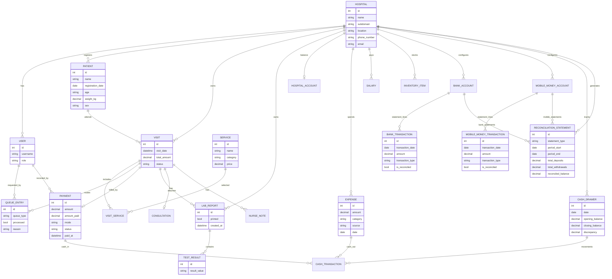

# Database ER Diagram (Mermaid)

Paste this Mermaid diagram into any Mermaid-capable viewer (GitHub Markdown preview supports it).

```mermaid
erDiagram
    HOSPITAL ||--o{ USER : has
    HOSPITAL ||--o{ PATIENT : registers
    HOSPITAL ||--o{ VISIT : owns
    PATIENT ||--o{ VISIT : attends
    VISIT ||--o{ VISIT_SERVICE : includes
    SERVICE ||--o{ VISIT_SERVICE : selected
    VISIT ||--o{ QUEUE_ENTRY : routes
    USER ||--o{ QUEUE_ENTRY : requested_by
    VISIT ||--o| PAYMENT : billed_by
    USER ||--o{ PAYMENT : recorded_by

    HOSPITAL ||--o{ LAB_REPORT : owns
    VISIT ||--o{ LAB_REPORT : attaches
    LAB_REPORT ||--o{ TEST_RESULT : contains

    VISIT ||--o| CONSULTATION : has
    VISIT ||--o{ NURSE_NOTE : has

    HOSPITAL ||--o| HOSPITAL_ACCOUNT : balance
    HOSPITAL ||--o{ EXPENSE : spends
    HOSPITAL ||--o{ SALARY : pays
    HOSPITAL ||--o{ INVENTORY_ITEM : stocks

    HOSPITAL ||--o{ BANK_ACCOUNT : configures
    BANK_ACCOUNT ||--o{ BANK_TRANSACTION : statement_lines

    HOSPITAL ||--o{ MOBILE_MONEY_ACCOUNT : configures
    MOBILE_MONEY_ACCOUNT ||--o{ MOBILE_MONEY_TRANSACTION : statement_lines

    HOSPITAL ||--o{ CASH_DRAWER : tracks
    CASH_DRAWER ||--o{ CASH_TRANSACTION : movements
    PAYMENT ||--o{ CASH_TRANSACTION : cash_in
    EXPENSE ||--o{ CASH_TRANSACTION : cash_out

    HOSPITAL ||--o{ RECONCILIATION_STATEMENT : generates
    BANK_ACCOUNT ||--o{ RECONCILIATION_STATEMENT : bank_statements
    MOBILE_MONEY_ACCOUNT ||--o{ RECONCILIATION_STATEMENT : mobile_statements

    %% Core attributes (summary)
    HOSPITAL {
        int id
        string name
        string subdomain
        string location
        string phone_number
        string email
    }
    USER {
        int id
        string username
        string role
    }
    PATIENT {
        int id
        string name
        date registration_date
        string age
        decimal weight_kg
        string sex
    }
    VISIT {
        int id
        datetime visit_date
        decimal total_amount
        string status
    }
    SERVICE {
        int id
        string name
        string category
        decimal price
    }
    PAYMENT {
        int id
        decimal amount
        decimal amount_paid
        string mode
        string status
        datetime paid_at
    }
    QUEUE_ENTRY {
        int id
        string queue_type
        bool processed
        string reason
    }
    LAB_REPORT {
        int id
        bool printed
        datetime created_at
    }
    TEST_RESULT {
        int id
        string result_value
    }
    EXPENSE {
        int id
        decimal amount
        string category
        string source
        date date
    }
    CASH_DRAWER {
        int id
        date date
        decimal opening_balance
        decimal closing_balance
        decimal discrepancy
    }
    BANK_TRANSACTION {
        int id
        date transaction_date
        decimal amount
        string transaction_type
        bool is_reconciled
    }
    MOBILE_MONEY_TRANSACTION {
        int id
        date transaction_date
        decimal amount
        string transaction_type
        bool is_reconciled
    }
    RECONCILIATION_STATEMENT {
        int id
        string statement_type
        date period_start
        date period_end
        decimal total_deposits
        decimal total_withdrawals
        decimal reconciled_balance
    }
```

