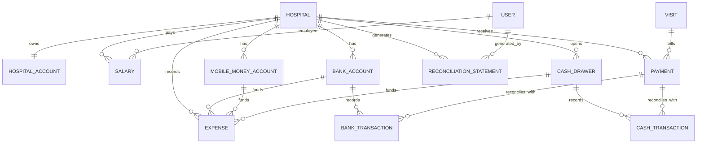

# Financial ER Diagram (Expense Source Tracking)

This diagram reflects the updated financial relationships where each `Expense` can be tied to the exact source account used to pay it.

## Expense Source Rules

- `Expense.source = bank_account` -> `Expense.bank_account` must be set.
- `Expense.source = mobile_money` -> `Expense.mobile_money_account` must be set.
- `Expense.source = cash_drawer` -> `Expense.cash_drawer` must be set.
- Non-selected account fields are cleared so every expense points to one source account only.
