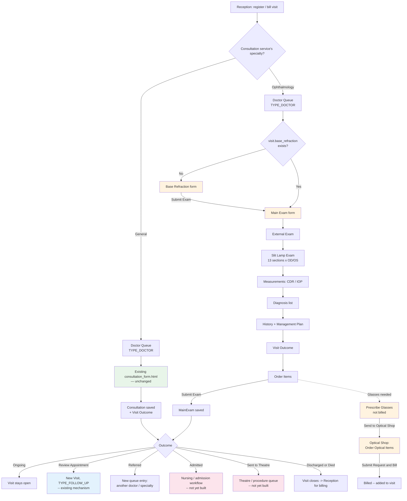
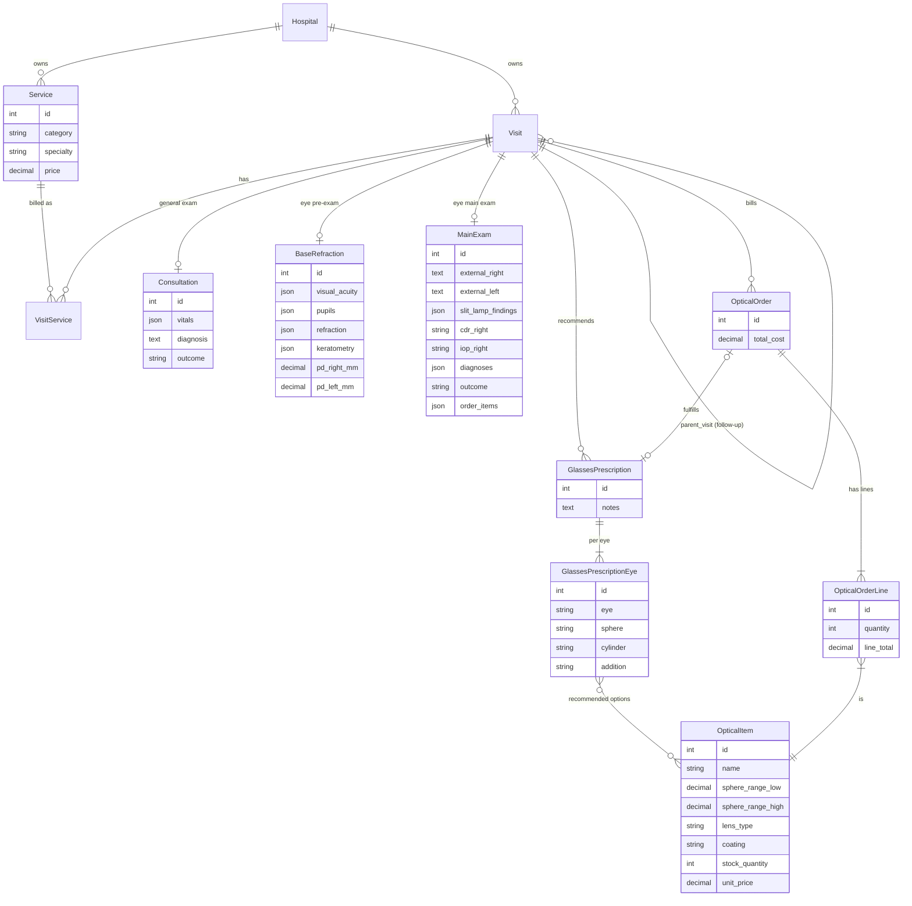

# Specialty-Triggered Doctor Consultations (Ophthalmology first) — Design Plan

> **Status: PLAN, not built.** This document captures what was studied from a reference system
> (Town Eye Clinic, an ophthalmology-specific EMR) and how it would map onto Ternah Health's
> existing architecture. Nothing described here has been implemented yet — it's the groundwork
> for a future build, and open questions are flagged explicitly rather than silently decided.

**Framework:** Django · **Scope:** `doctor` app (today), likely a new `ophthalmology` app · **Pattern:** category-triggered form branching, following precedent already in this codebase (Package services, Lab's DEFINED_OPTION tests)

---

## Table of Contents

1. [The Problem](#1-the-problem)
2. [Reference Study: Town Eye Clinic's Ophthalmology Flow](#2-reference-study-town-eye-clinics-ophthalmology-flow)
3. [Design Principles Extracted](#3-design-principles-extracted)
4. [Where Ternah Health Stands Today](#4-where-ternah-health-stands-today)
5. [Proposed Data Model](#5-proposed-data-model)
6. [The Trigger Mechanism](#6-the-trigger-mechanism)
7. [Visit Outcome — Cross-Cutting, Not Just Ophthalmology](#7-visit-outcome--cross-cutting-not-just-ophthalmology)
8. [End-to-End Flow](#8-end-to-end-flow)
9. [Entity Relationship Diagram](#9-entity-relationship-diagram)
10. [Open Questions](#10-open-questions)

---

## 1. The Problem

Today, every `Service` in category `consultation` behaves identically: reception bills it, it
routes to `QueueEntry.TYPE_DOCTOR`, and the doctor lands on one single generic form
(`doctor/templates/doctor/consultation_form.html`, backed by `doctor.models.Consultation`) — the
same form whether the visit is a general checkup or (once these exist) an ophthalmology or
dentistry visit.

The ask: picking a **specialty** consultation service at registration should **trigger** a
completely different exam flow for the doctor — not just a different form, but potentially a
different *shape* of visit (an eye visit has a pre-exam step a general visit doesn't). General
Consultation must keep working exactly as it does today; nothing about the existing flow should
change for it.

---

## 2. Reference Study: Town Eye Clinic's Ophthalmology Flow

Studied from `amitsa.furahatechnologies.com` — an existing ophthalmology-specific EMR. Two
screens, always shown against the same patient/visit-session banner (name, patient code, phone,
gender — same idea as Ternah's own per-visit patient banner already used throughout the doctor
module).

### 2.1 Base Refraction — the eye module's "triage"

Reached first. Analogous in *role* to Ternah's Nurse Triage-before-Doctor gate, but entirely
eye-specific in content:

| Section | Fields |
|---|---|
| **Visual Acuity** | Distance: `ph` and `cc` rows, Right/Left columns, each a Snellen-style dropdown (6/5, 6/6, 6/9, 6/12, 6/18, 6/24, 6/36, 6/60, 3/60, 2/60, 1/60, CF, HM, PL, NPL). Near: `cc` row, same dropdown style. Best Vision Right/Left Eye (single dropdowns). |
| **Neuro / Psych** | "Oriented x3" checkbox, Mood/Affect dropdown, Mood Description text, free-text notes. |
| **Pupils** | "PERRL" one-click shortcut, or per-eye (R/L): Dark (mm), Light (mm), Shape, React, APD — each its own dropdown/number. |
| **Refraction** | Three parallel sub-grids — **Autorefractor**, **Retinoscope**, **Subjective** — each Right/Left × Sphere/Cylinder/Axis. |
| **Keratometry** | Right/Left × K1/K2/Axis. |
| **Add / PD** | Near-add power (e.g. "+1.50 for reading"), Pupillary Distance for right eye, PD for left eye. |
| **Comments** | Free text. |

Submitted independently ("Submit Exam"), before the Main Exam is expected to be usable.

### 2.2 Main Exam — the ophthalmology "consultation"

Shows a banner when Base Refraction hasn't been submitted yet ("Base refraction has not been
submitted for this visit session," with a **Record Base Refraction** shortcut button) — but the
Main Exam page itself is still reachable, so this reads as a *nudge*, not necessarily a hard block
(see [Open Questions](#10-open-questions)).

| Section | Shape |
|---|---|
| **External Exam** | External Right / External Left — free text. |
| **Slit Lamp Examination** | Right Eye (OD) / Left Eye (OS) side by side, repeated across **13 anatomical sections in a fixed order**: Tear Film, Lid, Sclera, Conjunctiva, Cornea, Anterior Chamber, Pupil, Iris, Lens, Vitreous, Retina, Macula, Optic Disc. Each section is a per-eye checklist of standard findings specific to that structure (e.g. Cornea: Clear / Ulcer / Scar / Edema / neovascularisation / Dendritic ulcer / haze / KPs / abscess / …), **plus an "Add new finding" link per section per eye** — the checklist is a starting point, not a closed list. |
| **Measurements** | CDR Right, CDR Left, IOP Right, IOP Left — plain numeric inputs. |
| **Diagnosis** | A **repeatable list** ("+ Add Diagnosis"), not a single text field — starts empty. |
| **History Comments** | Free textarea. |
| **Management Plan** | Free textarea. |
| **Outcome** | **Visit Outcome** dropdown: Ongoing / Discharged / Referred / Admitted / Sent to Theatre / Died / Review Appointment. Defaults to Ongoing if left untouched. |
| **Order Items** | A section for ordering (labs/procedures/meds) from inside the exam — same idea as Ternah's own `Consultation.lab_requests`. For eyewear, this turns out to mean **Prescribe Glasses** — see §2.3. |

### 2.3 Prescribe Glasses & Optical Shop — a doctor recommendation, fulfilled and billed downstream

Two more screens, reached from the Main Exam's Order Items. In the reference system's own left
nav, Optical is nested **inside the Pharmacy module**, not a separate top-level section: Pharmacy
→ Overview / Pharmacy Requests / Pharmacy Inventory / POS / **Optical Requests / Optical Stock /
Glasses Prescriptions**.

**Prescribe Glasses (doctor side — explicitly NOT billed)**

> "Nothing here is billed to the patient. This sends a recommendation to the optical shop — staff
> there will pick the actual lens the patient can afford from the options you list below, add a
> frame, and bill once confirmed."

"+ Add Eye" repeatable block, per eye:

| Field | Notes |
|---|---|
| Eye | Right Eye (OD) / Left Eye (OS) |
| Sphere * | required, e.g. "-2.00" |
| Cylinder | optional |
| Addition | optional — same near-add concept as Base Refraction's "Add" field |
| Recommended Lens Options * | a **searchable multi-select**, grouped into "Lenses (Single Vision)" and "Additionals (Progressive / Bifocal)" — the doctor doesn't pick one exact lens, they list *every* design the optical shop is allowed to offer. Helper text: "Search by name — select every lens design the optical shop may offer the patient for this eye." "Remove Eye" per block. |

Notes field, then submit: **Send to Optical Shop**.

**Order Optical Items (optical shop side — this IS the bill)**

"+ Add Optical Item" repeatable block. Each line:

| Field | Notes |
|---|---|
| Optical Item * | a searchable picker of actual stocked SKUs, each labeled by spec — e.g. `0.00-1.00 CYL -5.50- -7.25 SV/MAR/WHITE (Stock: 1)` (cylinder range, sphere range, SV = Single Vision, MAR = anti-reflective coating, colour/tint, live stock count) |
| Quantity * | numeric |
| Line Total | read-only, computed |

Total Cost sums all lines. Submit: **Submit Request & Bill** — this is the actual charge point.

**The new pattern this introduces:** unlike a drug prescription (order exactly one
`InventoryItem`) or a lab request (order exactly one `LabTest`), **Prescribe Glasses orders a set
of acceptable options, and a second party downstream commits to exactly one specific stocked item
and bills it**. This isn't a rename of an existing Ternah pattern — the closest precedent is still
`Prescription` (doctor orders, someone else dispenses/bills later), but the "recommend N, fulfill
1" step doesn't exist anywhere in Ternah today.

---

## 3. Design Principles Extracted

1. **A specialty consultation is two stages, not one** — a specialty-specific pre-exam (Base
   Refraction) gates a specialty-specific main exam, mirroring (but extending) Ternah's existing
   Nurse Triage → Doctor gate, just per-specialty instead of one-size-fits-all.
2. **Findings are structured checklists, not narrative text** — per anatomical region, per
   eye/side, each a togglable list of standard options, with an escape hatch for anything not
   listed.
3. **Diagnosis is a list, not a field** — a visit can carry more than one diagnosis.
4. **Visit Outcome is a standardized disposition, captured once at the end of the exam** — a
   small, fixed vocabulary that (per the explicit ask) belongs on *every* doctor consultation
   type, not just ophthalmology.
5. **The specialty determines the whole downstream form**, not just a cosmetic label — this is a
   genuine *trigger*, not a variant of the same form.
6. **A recommendation can list several acceptable options; fulfillment commits to exactly one.**
   Prescribe Glasses lists every lens design the optical shop may offer — the shop then picks the
   one the patient can actually afford and bills that single item (§2.3). Different shape from
   Ternah's existing Prescription flow, which orders one exact drug up front.

---

## 4. Where Ternah Health Stands Today

- `reception.Service.category = "consultation"` is a single flat category
  (`reception/models.py`) — no specialty dimension exists on it at all today.
- Every consultation service routes identically: `queue_types_for_service()`
  (`reception/views.py`) maps `CATEGORY_CONSULTATION → QueueEntry.TYPE_DOCTOR` unconditionally,
  regardless of which specific service was billed.
- `doctor.models.Consultation` (`doctor/models.py:8`) is one flat model, one per visit
  (`OneToOneField` to `Visit`): `vitals` (JSONField), `signs_symptoms`, `diagnosis` (single text
  field, not a list), `treatment`, `lab_requests` (JSONField), `follow_up_date`. No specialty
  concept, no outcome field.
- `doctor/templates/doctor/consultation_form.html` is the one form every doctor visit renders,
  regardless of the service billed.
- **Precedent for "category-conditional extra behavior" already exists** and is the direct model
  to follow: `admin_dashboard.forms.HospitalServiceForm` already shows/hides extra fields
  (`package_services`, `package_drugs`, `lab_tests_next`, `max_visits`, `validity_months`) purely
  based on the `Service.category` selected, toggled by a small JS block in
  `manage_services.html`/`object_form.html`. A `Service.specialty` field, shown only when
  `category == consultation`, is the same pattern applied one level deeper.
- **Precedent for "gate one step behind another" already exists**: `Visit.TYPE_FOLLOW_UP`
  requires its `parent_visit` to be `STATUS_COMPLETED` and fully paid before it can be created at
  all (`reception/forms.py` `_clean_follow_up_visit`) — a hard gate, enforced server-side, not
  just a UI nudge. Worth deciding which style Base Refraction should follow (see
  [Open Questions](#10-open-questions)).
- **Precedent for "Review Appointment"-style outcomes already exists**: `Visit.TYPE_FOLLOW_UP`
  (free return visit linked to a completed, paid parent visit, routed straight to the doctor
  queue) is functionally exactly what a "Review Appointment" outcome should schedule — this isn't
  new infrastructure, it's a new *trigger into* infrastructure that already works.

---

## 5. Proposed Data Model

Kept entirely **separate** from the existing `Consultation` model rather than overloading it —
the general flow stays byte-for-byte untouched, and the eye-specific tables can grow (13 slit-lamp
sections × 2 eyes) without dragging every other specialty's schema along.

```python
# reception/models.py — Service gains one new field, only meaningful for category=consultation
class Service(models.Model):
    ...
    SPECIALTY_GENERAL = "general"
    SPECIALTY_OPHTHALMOLOGY = "ophthalmology"
    SPECIALTY_DENTISTRY = "dentistry"          # placeholder — not detailed yet, see Open Questions
    SPECIALTY_CHOICES = [
        (SPECIALTY_GENERAL, "General"),
        (SPECIALTY_OPHTHALMOLOGY, "Ophthalmology"),
        (SPECIALTY_DENTISTRY, "Dentistry"),
    ]
    specialty = models.CharField(max_length=20, choices=SPECIALTY_CHOICES, default=SPECIALTY_GENERAL)
```

```python
# ophthalmology/models.py — new app (see Open Questions on whether this should be its own app)

class BaseRefraction(models.Model):
    visit = models.OneToOneField("reception.Visit", on_delete=models.CASCADE, related_name="base_refraction")
    visual_acuity = models.JSONField(default=dict)      # {"distance": {"ph": {...}, "cc": {...}}, "near": {...}, "best_vision": {...}}
    neuro_psych = models.JSONField(default=dict)
    pupils = models.JSONField(default=dict)              # {"perrl": bool, "right": {...}, "left": {...}}
    refraction = models.JSONField(default=dict)          # {"autorefractor": {...}, "retinoscope": {...}, "subjective": {...}}
    keratometry = models.JSONField(default=dict)
    add_power = models.CharField(max_length=20, blank=True)
    pd_right_mm = models.DecimalField(max_digits=4, decimal_places=1, null=True, blank=True)
    pd_left_mm = models.DecimalField(max_digits=4, decimal_places=1, null=True, blank=True)
    comments = models.TextField(blank=True)
    submitted_by = models.ForeignKey(settings.AUTH_USER_MODEL, on_delete=models.SET_NULL, null=True)
    submitted_at = models.DateTimeField(auto_now_add=True)


class MainExam(models.Model):
    visit = models.OneToOneField("reception.Visit", on_delete=models.CASCADE, related_name="ophthalmology_main_exam")
    external_right = models.TextField(blank=True)
    external_left = models.TextField(blank=True)
    # {"tear_film": {"right": ["Normal"], "left": ["Dry", "Debris"], "right_custom": "", "left_custom": ""}, "lid": {...}, ...}
    slit_lamp_findings = models.JSONField(default=dict)
    cdr_right = models.CharField(max_length=20, blank=True)
    cdr_left = models.CharField(max_length=20, blank=True)
    iop_right = models.CharField(max_length=20, blank=True)
    iop_left = models.CharField(max_length=20, blank=True)
    diagnoses = models.JSONField(default=list)           # ["Diagnosis text 1", "Diagnosis text 2", ...]
    history_comments = models.TextField(blank=True)
    management_plan = models.TextField(blank=True)
    outcome = models.CharField(max_length=20, choices=VisitOutcome.CHOICES, default=VisitOutcome.ONGOING)  # see §7
    order_items = models.JSONField(default=list)          # shape TBD — likely mirrors Consultation.lab_requests
    submitted_by = models.ForeignKey(settings.AUTH_USER_MODEL, on_delete=models.SET_NULL, null=True)
    submitted_at = models.DateTimeField(auto_now_add=True)
```

The 13 slit-lamp sections' standard finding options (Tear Film → Normal/Dry/Excessive
Tearing/Debris, Cornea → Clear/Ulcer/Scar/…, etc.) are a fixed clinical vocabulary — proposed as
plain Python constants (a dict of `{section: [options...]}`) rather than an admin-editable catalog
like `DefinedOption`, since these are standard ophthalmology terms unlikely to need
per-hospital customization. Flagged as an open question if that assumption is wrong.

### 5.1 Optical — Prescribe Glasses & Fulfillment (§2.3)

```python
# ophthalmology/models.py (or optical/models.py — see Open Questions)

class GlassesPrescription(models.Model):
    visit = models.ForeignKey("reception.Visit", on_delete=models.CASCADE, related_name="glasses_prescriptions")
    prescribed_by = models.ForeignKey(settings.AUTH_USER_MODEL, on_delete=models.SET_NULL, null=True)
    notes = models.TextField(blank=True)
    created_at = models.DateTimeField(auto_now_add=True)
    # never billed directly -- OpticalOrder is the charge point (see below)


class GlassesPrescriptionEye(models.Model):
    prescription = models.ForeignKey(GlassesPrescription, on_delete=models.CASCADE, related_name="eyes")
    eye = models.CharField(max_length=2, choices=[("OD", "Right Eye"), ("OS", "Left Eye")])
    sphere = models.CharField(max_length=10)
    cylinder = models.CharField(max_length=10, blank=True)
    addition = models.CharField(max_length=10, blank=True)
    # the "list of acceptable options" from principle #6 -- not one exact lens
    recommended_lens_options = models.ManyToManyField("OpticalItem", related_name="recommended_for")


class OpticalItem(models.Model):
    """A stocked lens/frame SKU. Proposed as its OWN model rather than
    reusing InventoryItem -- the attribute shape (sphere/cylinder RANGE
    matching, coating, colour) doesn't fit InventoryItem's drug-oriented
    schema (unit/base_unit/units_per_pack/strength_mg_per_unit). See
    Open Questions on whether that split is actually worth it."""
    hospital = models.ForeignKey("accounts.Hospital", on_delete=models.CASCADE)
    name = models.CharField(max_length=200)  # e.g. "0.00-1.00 CYL -5.50- -7.25 SV/MAR/WHITE"
    sphere_range_low = models.DecimalField(max_digits=5, decimal_places=2)
    sphere_range_high = models.DecimalField(max_digits=5, decimal_places=2)
    cylinder_range_low = models.DecimalField(max_digits=5, decimal_places=2)
    cylinder_range_high = models.DecimalField(max_digits=5, decimal_places=2)
    lens_type = models.CharField(max_length=30)   # Single Vision / Bifocal / Progressive
    coating = models.CharField(max_length=30, blank=True)   # MAR / none / ...
    colour = models.CharField(max_length=30, blank=True)    # WHITE / BLUECUT / ...
    stock_quantity = models.IntegerField(default=0)
    unit_price = models.DecimalField(max_digits=10, decimal_places=2)


class OpticalOrder(models.Model):
    """The billed fulfillment -- optical shop staff pick specific items
    from (optionally) a GlassesPrescription's recommended options."""
    visit = models.ForeignKey("reception.Visit", on_delete=models.CASCADE, related_name="optical_orders")
    prescription = models.ForeignKey(GlassesPrescription, on_delete=models.SET_NULL, null=True, blank=True)
    fulfilled_by = models.ForeignKey(settings.AUTH_USER_MODEL, on_delete=models.SET_NULL, null=True)
    total_cost = models.DecimalField(max_digits=10, decimal_places=2, default=0)
    created_at = models.DateTimeField(auto_now_add=True)


class OpticalOrderLine(models.Model):
    order = models.ForeignKey(OpticalOrder, on_delete=models.CASCADE, related_name="lines")
    item = models.ForeignKey(OpticalItem, on_delete=models.PROTECT)
    quantity = models.PositiveIntegerField(default=1)
    line_total = models.DecimalField(max_digits=10, decimal_places=2)
```

`OpticalOrder`/`OpticalOrderLine` would bill the same way a `VisitService` line does today (add to
`visit.total_amount`, show on the receipt) — exact integration point (a dedicated `Service`
category, or its own billing path like `Prescription`'s) is an open question below.

---

## 6. The Trigger Mechanism

Nothing changes about **billing or routing** — a specialty consultation service still bills and
routes to `QueueEntry.TYPE_DOCTOR` exactly like General Consultation does today, via the existing
`queue_types_for_service()` path. The trigger only changes **what the doctor sees when they open
that queue entry**:

1. Reception bills "Ophthalmology Consultation" (a `Service` with `category=consultation`,
   `specialty=ophthalmology`) — created the same way any consultation service is created today,
   just with the new field set.
2. The doctor's queue entry for this visit is indistinguishable from any other doctor queue entry
   — same `QueueEntry.TYPE_DOCTOR`.
3. When the doctor opens the visit, a dispatcher (either the existing `consultation(request,
   visit_id)` view, or a thin wrapper in front of it) looks up the visit's billed consultation
   service's `specialty`:
   - `general` (default) → renders exactly what renders today. **Zero behavior change.**
   - `ophthalmology` → redirects to the Base Refraction or Main Exam view depending on whether
     `visit.base_refraction` already exists.

This is the same shape as `_sync_hospital_service`/`HospitalServiceForm`'s category-conditional
branching already used elsewhere — just one more category value driving one more branch.

---

## 7. Visit Outcome — Cross-Cutting, Not Just Ophthalmology

Explicitly requested for **every** doctor consultation type, general included. Proposed as a
single shared choices class both models reference, so the vocabulary never drifts between
specialties — important for future reporting (e.g. "how many patients were Referred this month,"
across every specialty at once):

```python
# doctor/models.py (or a small shared module both doctor and ophthalmology import from)
class VisitOutcome(models.TextChoices):
    ONGOING = "ongoing", "Ongoing"
    DISCHARGED = "discharged", "Discharged"
    REFERRED = "referred", "Referred"
    ADMITTED = "admitted", "Admitted"
    THEATRE = "theatre", "Sent to Theatre"
    DIED = "died", "Died"
    REVIEW = "review", "Review Appointment"
```

Added to `Consultation` (general) as `outcome = models.CharField(..., choices=VisitOutcome.choices,
default=VisitOutcome.ONGOING)`, and to `MainExam` the same way. Default `Ongoing` if the doctor
doesn't touch it, matching the reference system exactly.

**Each outcome value implies downstream routing** — this is the part worth designing carefully,
not just adding as a label:

| Outcome | Suggested effect |
|---|---|
| Ongoing | No change — visit stays open, same as today. |
| Review Appointment | Creates the review as a `Visit.TYPE_FOLLOW_UP` off this visit — **already-built infrastructure**, just needs a new trigger point. |
| Referred | Routes to another doctor/specialty queue — needs a "refer to" picker (which specialty/doctor). |
| Admitted | Hands off to a nursing/admission workflow — Ternah doesn't have inpatient admission yet; flag as new scope. |
| Sent to Theatre | Needs a theatre/procedure queue — doesn't exist yet; flag as new scope. |
| Discharged / Died | Visit closes — routes to billing/reception the same way a normal consultation finishing does today. |

---

## 8. End-to-End Flow



Green = existing, unchanged. Orange = new, ophthalmology-specific. Blue = new trigger, but into
already-built infrastructure (`TYPE_FOLLOW_UP`). Pink = genuinely new scope, not yet designed.

---

## 9. Entity Relationship Diagram



---

## 10. Open Questions

Not decided yet — flagged rather than silently assumed, since more requirements are still coming:

1. **Hard gate or soft nudge?** Does Main Exam actually *block* submission until Base Refraction
   exists, or is the reference system's warning banner purely informational (Main Exam stayed
   reachable in the screenshots even with the banner showing)?
2. **New Django app, or inside `doctor`?** Given the sheer size of the slit-lamp checklist alone,
   a dedicated `ophthalmology` app (mirroring how `nurse`/`lab` are already split out from
   `doctor`/`reception`) seems right, but worth confirming before scaffolding it.
3. **Are the slit-lamp finding options admin-configurable per hospital**, or a fixed clinical
   vocabulary shipped with the system? Affects whether this needs a `DefinedOption`-style catalog
   model or plain Python constants.
4. **Dentistry** was named alongside Ophthalmology as a second specialty trigger — no reference
   material for it yet, so it's only stubbed as a `SPECIALTY_CHOICES` placeholder above pending
   its own walkthrough.
5. **Referred / Admitted / Sent to Theatre** routing needs real design once you're ready — this
   plan only names them as outcomes and flags what's missing, it doesn't design the receiving
   workflows.
6. **Order Items** on the Main Exam — ~~shape not yet detailed~~ **partially answered**: for
   eyewear it's Prescribe Glasses (§2.3). Still open whether other order types (labs, procedures)
   also route through the same "Order Items" section or stay on their own existing paths.
7. **Should Optical be its own module, or nested under Pharmacy** the way the reference system
   does it (Pharmacy → Optical Requests / Optical Stock / Glasses Prescriptions as sub-items)?
   Affects whether it needs its own queue type/role or reuses Pharmacy's.
8. **`OpticalItem` as its own model, or extend `InventoryItem`?** The proposal in §5.1 keeps them
   separate since lens SKUs (sphere/cylinder ranges, coating, colour) don't fit
   `InventoryItem`'s drug-oriented fields (unit/base_unit/strength_mg_per_unit) — but if the
   overlap in practice is small, a shared model with optional fields might be less duplication.
9. **How does `OpticalOrder` actually bill?** Same shape as `VisitService` (a `Service` row per
   order, added to `visit.total_amount`), or its own parallel billing path like `Prescription`
   already has? The reference system's "Submit Request & Bill" suggests it's a direct charge, not
   routed through a separate approval step the way lab requests are.
