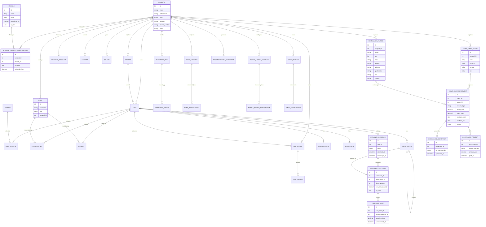
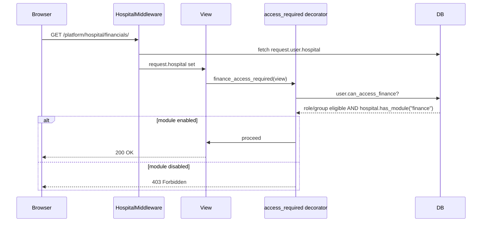

# Lumina Medical Services — System Design Document

## 1. Overview

Lumina is a **multi-tenant hospital/clinic management platform**. Each customer (a hospital, clinic, or — as of this design — an independent home-care doctor) is one **tenant**, represented by a single `Hospital` row. All operational data is scoped to a hospital via a `hospital` foreign key, enforced manually in every view (`hospital = get_active_hospital(request)` → `.filter(hospital=hospital)`).

The platform is sold as a set of **independently priced modules**. A hospital subscribes to only the modules relevant to its business — a full clinic takes everything; a lab-only facility takes Reception + Lab; an independent home-care doctor takes only Home Care Management.

## 2. Tenancy Model

```
Hospital (tenant)
 └── User (staff, FK to Hospital, role + group based permissions)
      └── can_access_X properties check:
           1. role/group eligibility, AND
           2. hospital.has_module(code)  ← module subscription gate
```

- **Isolation mechanism:** row-level, via `hospital_id` FK + manual `.filter(hospital=...)` in every view. Not database-enforced (no Postgres RLS) — enforced by code discipline.
- **Identification:** `HospitalMiddleware` sets `request.hospital` from `request.user.hospital`, with subdomain-based fallback for anonymous/pre-login contexts.
- **Superadmin bypass:** `User.is_superadmin` short-circuits every `can_access_X` check — the platform owner sees everything, unscoped.

## 3. Module & Subscription System

Introduced to let hospitals buy only what they need, and to let the platform track recurring revenue per module.

```
Module                          HospitalModuleSubscription
─────────────────────           ─────────────────────────
code (unique)            ◄────  module_id (FK)
name                             hospital_id (FK)
monthly_price                    is_active
is_core (bool)                   subscribed_at
url_name
icon_svg
display_order
```

- **Core modules** (`is_core=True`) are force-included on every hospital regardless of checkbox state at onboarding — currently only **Reception**.
- **Exception carve-out:** Home Care Management is exempt from triggering the Reception auto-include — a pure home-care doctor tenant never gets Reception forced on.
- **Gating is enforced at three layers**, not just hidden UI:
  1. **View decorators** (`inventory_access_required`, `finance_access_required`, future `home_care_access_required`) — block direct URL access even if a link is hidden.
  2. **Sidebar rendering** — each nav block independently checks its own `can_access_X`.
  3. **Workflow routing** — `reception/workflow.py::require_module_for_queue_type()` blocks handing a patient off to a module the hospital doesn't have, at the single chokepoint function (`ensure_pending_queue_entry`) every cross-module handoff already passes through.

## 4. Modules Catalog (current + proposed)

| Module | Code | Price/mo | Core | Status |
|---|---|---|---|---|
| Reception | `reception` | Free | Yes | Live |
| Doctor | `doctor` | 50,000 | No | Live |
| Nurse | `nurse` | 50,000 | No | Live |
| Lab | `lab` | 50,000 | No | Live |
| Pharmacy/Inventory | `inventory` | 50,000 | No | Live |
| Finance | `finance` | 50,000 | No | Live |
| **Home Care Management** | `home_care` | 50,000 | No | **Proposed** (this design) |

## 4a. Configurable Inter-Module Workflow Routing (Proposed)

### Problem

Module on/off (Sections 3–4) controls **whether** a hospital can reach a module at all. It does not control **how** two enabled modules hand a patient off to each other — that behavior is currently hardcoded in the views.

Concretely: today, a doctor's lab request does not go straight to the lab queue. It is first routed back to the **Reception queue for approval**, and only once Reception approves it does a lab `QueueEntry` get created. This approval step is written directly into `reception/views.py` — it is the same for every hospital, with no way to turn it off.

### Real-world case this breaks

A hospital subscribed to only **Reception + Lab + Finance** (no Doctor module) has no doctor to approve anything via — for them, the natural flow is **Reception → Lab directly**, and **Lab → Reception directly** when results are ready, with no intermediate approval gate. Forcing the existing approval-based flow onto a hospital that structurally has no doctor in the loop is the wrong default for that client.

### Proposed model: `HospitalWorkflowRule`

One row per hospital, per module-to-module handoff:

| Field | Type | Notes |
|---|---|---|
| hospital | FK → Hospital | |
| from_module | CharField (Module code) | e.g. `"reception"` |
| to_module | CharField (Module code) | e.g. `"lab"` |
| mode | Choice | `direct` (handoff happens immediately) / `requires_approval` (passes through an intermediate queue first — today's default) |

This is configured **at hospital setup**, alongside the module on/off checkboxes — a hospital admin does not self-configure this; it is part of the superadmin onboarding flow, same governance model as module selection itself.

### Where it plugs in

The exact chokepoint built in Phase 3 already exists for this: `require_module_for_queue_type()` in `reception/workflow.py`, called from `ensure_pending_queue_entry()` — the single function every cross-module handoff already passes through. Routing mode becomes one more check at that chokepoint: *is this hospital allowed to route here at all* (existing), and now also *should this go direct, or through approval first* (new).

### Honest complexity assessment

This is **not** a generic toggle the way module on/off was. Module on/off has one shape repeated six times (`can_access_X` checks the same way for every module). Workflow routing mode is **not uniform across module pairs** — Reception→Lab approval logic is structurally different from a hypothetical Doctor→Nurse handoff. Each routing pair needs its own direct-vs-approval branch written in code; the `HospitalWorkflowRule` model only decides *which* branch runs, it doesn't eliminate the need to write both branches per pair. This is real, scoped engineering work, not a quick add — but it is buildable on the existing chokepoint without restructuring anything already built.

### Status

Documented for planning. Not yet implemented.

## 5. Full Entity-Relationship Diagram



## 6. Request Flow — Module Access Check



## 7. Scaling Assessment — How Far Can This Go With More Hospitals?

### What scales well today

- **Database:** Postgres in production (DigitalOcean-managed, via `DATABASE_URL`) — handles concurrent multi-tenant writes fine at moderate scale. SQLite is dev-only fallback.
- **Tenant isolation pattern:** FK + filter is a well-understood SaaS pattern (Shopify, many B2B SaaS products use exactly this at far larger scale than this platform currently needs).
- **Module system:** adding a new module is now a checklist (Module row + property + decorator + sidebar block), not a redesign — confirmed by having added two modules (Inventory, Finance) plus designing a third (Home Care) without touching the core mechanism.
- **No tenant-specific schemas or databases** — every hospital lives in the same tables, which keeps operational overhead (migrations, backups, monitoring) constant regardless of tenant count. This is the right choice for the 10s–low-100s of hospitals range.

### What needs attention as hospital count grows

| Concern | Current state | When it matters | Mitigation |
|---|---|---|---|
| Forgotten `.filter(hospital=...)` | Manual discipline, no DB-level enforcement | Any scale — but risk *probability* rises with more views/more developers touching code | Write automated tests asserting cross-tenant isolation (e.g. "Hospital A admin cannot see Hospital B's visits") — currently absent |
| Query performance on shared tables | Fine at current data volume | Once total `Visit`/`Payment` rows across *all* hospitals reach the high hundreds-of-thousands to millions | Add composite indexes on `(hospital_id, created_at)` style columns on hot tables; consider partitioning by `hospital_id` only if a single table exceeds tens of millions of rows |
| Dashboard aggregation queries (financial charts, module income) | Computed live per request, looping over all hospitals in Python | Becomes slow once hospital count is in the hundreds (the superadmin dashboard loops `for hospital in all_hospitals` in Python) | Move to DB-side aggregation (`annotate`/`aggregate` with `Sum`/`Count` grouped by hospital) instead of Python loops once hospital count exceeds ~50-100 |
| Single Postgres instance | One managed DB instance on DigitalOcean | High hundreds of hospitals with heavy concurrent write load (e.g. many receptionists billing simultaneously across many hospitals) | Vertical scaling first (bigger DB instance) — this buys a lot of headroom before any read-replica or sharding strategy is needed |
| Static/media storage (hospital logos, receipts) | Presumably local/App Platform storage | Matters once logo/file count grows | Move to object storage (DigitalOcean Spaces / S3-compatible) if not already done — check current `MEDIA_ROOT` config |
| Background/async work | None currently — everything is synchronous request/response | Matters if contract/receipt generation, report emailing, or large CSV exports grow heavy | Introduce a task queue (Celery + Redis, or DigitalOcean's managed equivalent) only when a specific operation starts blocking requests noticeably |

### Practical scaling ceiling, given the current architecture

**Comfortable today, with zero changes:** roughly **tens of hospitals**, each with normal clinic-scale daily traffic (dozens to low hundreds of visits/day). This is well within what a single well-indexed Postgres instance and a single Django app server handle without strain.

**To comfortably reach low hundreds of hospitals:**
1. Run the cross-tenant isolation audit (mentioned in earlier planning) — write the missing automated tests.
2. Convert the superadmin dashboard's Python-loop aggregations (module income, hospital onboarding counts) to DB-side `annotate`/`aggregate` queries.
3. Add indexes on `hospital_id` combined with the date/status fields most queried (`Visit.visit_date`, `Payment.paid_at`, etc.) if not already present via Django's automatic FK indexing.
4. Confirm media storage is already off local disk (App Platform's filesystem is ephemeral on redeploy — this matters for *correctness*, not just scale).

**Beyond low hundreds of hospitals** (enterprise multi-hospital-chain scale): that's when read replicas, caching layers (Redis for dashboard aggregates), and possibly splitting the superadmin analytics workload onto a separate reporting database become worth the added operational complexity. Not a near-term concern.

### Bottom line

The architecture chosen (single shared schema, FK-based tenancy, module-gated feature access) is the correct, standard choice for a platform at this stage and for the foreseeable growth range (tens to low hundreds of hospitals). Nothing about adding Home Care Management — or any future module — changes this scaling picture; the module system was specifically designed to keep adding products cheap regardless of tenant count.
