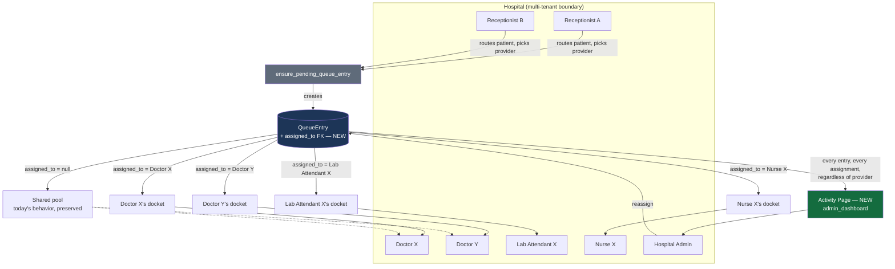
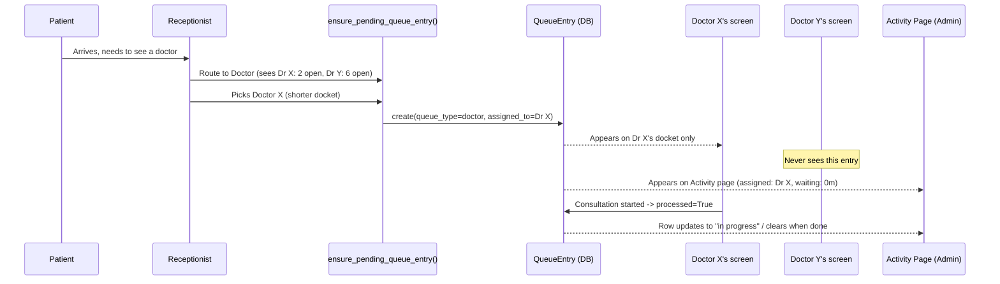

# Provider Assignment & Activity Oversight — Feasibility & Architecture

**Status:** Proposal / not yet built. Written for a future implementation pass, not this session.
**Author:** Claude (Ternah Health engineering session), reviewed against the codebase as of this commit.

## 1. The ask, in plain terms

At scale (a busy hospital doing ~200 patients/day, several doctors, nurses, lab attendants,
and receptionists on shift at once), reception needs to hand a patient to a *specific*
available provider — Doctor X, Lab Attendant Y — not just drop them into a shared pile. Each
provider should then only see their own assigned patients, not everyone's. Reception itself
can have multiple staff working the front desk concurrently. And admin/management wants one
screen — "Activity" — that shows every active queue across the hospital, who each patient is
assigned to, and what's actually being worked on right now.

## 2. Feasibility verdict

**Feasible, and closer than it looks.** This is not a rearchitecture — it's a targeted
extension of infrastructure that already exists and already works. Three things make this a
medium-sized, well-bounded project rather than a rebuild:

1. **Every queue already flows through one model and one routing choke point.**
   `reception.QueueEntry` (`reception/models.py`) is the single table every queue — doctor,
   nurse, lab, sonographer, reception, phlebotomy — is already built on
   (`queue_type` + `hospital` + `visit` + `processed`). Every screen that sends a patient
   somewhere already calls through `ensure_pending_queue_entry()` / `send_to_reception_queue()`
   in `reception/workflow.py`. Adding a `assigned_to` field to one model and threading it
   through one function is a contained change, not a scattered one.

2. **The "addressed to one specific person" concept already exists, partially.**
   `doctor_queue()` (`doctor/views.py:776`) already filters differently depending on whether an
   entry is a generic new-consultation request (shared pool, any doctor can pick it up) versus a
   "lab results ready" follow-up, which is filtered to `requested_by=request.user` — i.e. sent
   back to the *specific* doctor who ordered the test. That's assignment logic, already written,
   already proven in production, just scoped to one narrow case instead of applied generally.
   Generalizing that into a first-class `assigned_to` field is evolution, not invention.

3. **Hospital-level multi-tenancy and role-based access are already solid.** Every relevant
   model is already scoped by `hospital`, every view already knows the requesting user's `role`
   (`ROLE_DOCTOR`, `ROLE_NURSE`, `ROLE_LAB_ATTENDANT`, `ROLE_RECEPTIONIST`, `ROLE_HOSPITAL_ADMIN`,
   `ROLE_SUPERADMIN`, plus `ROLE_OWNER` for multi-branch — see `accounts/models.py`). None of
   that needs to change; assignment is a filter layered on top of infrastructure that already
   enforces "your hospital's data only."

**One part of the ask is already fully solved today, no work needed:** multiple receptionists
working concurrently. Reception's job is to *see and route everyone*, not to hold an isolated
docket — the current shared, hospital-scoped reception queue already supports any number of
receptionists working the same front desk at once. Nothing to build there. (If "multiple
receptions" instead meant *multiple physical branches*, that's the already-existing
Organization/Owner multi-branch feature built earlier in this engagement — a separate,
already-shipped capability, not part of this proposal.)

**What's genuinely new work:**

| Piece | Scope | Why |
|---|---|---|
| `assigned_to` field on `QueueEntry` | Small | One migration, one FK to `User` |
| Assignment picker in reception's routing UI | Medium | Reception needs to *choose* a provider, not just a category |
| Provider availability signal | Medium — a real design decision, see §5 | Reception needs to know who's free |
| Per-provider queue filtering | Medium | `doctor_queue()`, the lab `queue()`, and the nurse equivalent each need `assigned_to=request.user` added |
| Reassignment | Small–Medium | A provider going on break mid-shift needs their docket handed off |
| Activity page (admin) | Small, *given* the above | Once `assigned_to` exists, this is mostly a read-only report over `QueueEntry` |

Nothing here requires touching billing, the lab result engine, or the multi-tenant boundary —
those stay exactly as they are.

## 3. Current architecture (what exists today)

- `reception.QueueEntry` — the shared queue table. `queue_type` says *which* queue (doctor,
  nurse, lab, etc.); `hospital` scopes it; `requested_by` records who *sent* the patient there;
  `processed` marks it handled. **No field records who it's *for*.**
- `reception/workflow.py` — `ensure_pending_queue_entry()` is the one function every queue-entry
  creation path calls through. `send_to_reception_queue()`, `mark_queue_entries_processed()`
  sit next to it.
- Provider-facing queue views (`doctor_queue()`, `lab.views.queue()`, the nurse equivalent) each
  independently query `QueueEntry.objects.filter(queue_type=..., processed=False, hospital=...)`
  — a shared pool every staff member with that role can see and act on.
- Attribution *after the fact* exists everywhere (`LabOrder.collected_by`, `LabResult.entered_by`
  / `released_by`, `Consultation.created_by`, `NurseNote.created_by`) — the system already
  records who *did* something. It just doesn't yet record who was *supposed to*.

## 4. Proposed design

### 4.1 Data model

Add to `QueueEntry`:

```python
assigned_to = models.ForeignKey(
    settings.AUTH_USER_MODEL, on_delete=models.SET_NULL, null=True, blank=True,
    related_name="assigned_queue_entries",
    help_text="The specific provider this patient was routed to. Blank = shared pool "
               "(today's behavior), preserved for any queue type that doesn't need "
               "per-provider assignment.",
)
```

`null=True` is deliberate: every existing queue keeps working exactly as it does today until a
hospital's workflow explicitly starts assigning. No forced migration of behavior.

### 4.2 Assignment at hand-off

Reception's routing screens (the same places that call `ensure_pending_queue_entry()` today)
gain a provider picker — a dropdown of `User.objects.filter(hospital=..., role=..., is_active=True)`
for the relevant role. `ensure_pending_queue_entry()` gains an `assigned_to=None` kwarg, threaded
through to the `QueueEntry` it creates.

### 4.3 Availability signal

This is the one real design decision to make before building, not something to guess at:

- **Option A — manual on/off duty toggle.** Each provider flips "Available" / "Off Duty" on
  their dashboard. Simple, explicit, but relies on people remembering to toggle it.
- **Option B — inferred from current docket size.** Reception's picker shows each provider's
  current open (`processed=False`) assignment count live, so reception can just pick whoever has
  the shortest line. No new field, no one has to remember anything — but "quiet" doesn't
  distinguish "free" from "on lunch."
- **Option C — both.** Manual toggle for true unavailability (off shift, on break), backed by
  a live docket-count as the tiebreaker among everyone who's on. Best of both, more UI.

**Recommendation: start with B, add the manual toggle in a second pass once the basic
assignment flow is proven in real use.** It needs zero new state and reuses data the system
already has — `QueueEntry` counts per provider are a straightforward aggregate query.

### 4.4 Per-provider filtering

Each provider-facing queue view adds one clause:

```python
if not is_admin_viewer:
    queue_entries = queue_entries.filter(Q(assigned_to=request.user) | Q(assigned_to__isnull=True))
```

Unassigned entries stay visible to everyone in that role (today's shared-pool behavior,
preserved), assigned ones narrow to the named provider. Admins/superadmins keep seeing
everything, same as the existing `is_admin_viewer` carve-out in `doctor_queue()` today.

### 4.5 Reassignment

A queue entry's `assigned_to` can be changed by reception or a hospital admin — a small action
on the reception queue screen and/or directly from the new Activity page (§4.6). Reassignment
should be audit-logged (`accounts.AuditLog`, the same mechanism already used for admin overrides
elsewhere in the app) so there's a record of who moved a patient and when.

### 4.6 The Activity page

A new hospital-admin screen (fits naturally under `admin_dashboard`) listing every
`processed=False` `QueueEntry` for the hospital, joined to `assigned_to`, `visit.patient`,
`queue_type`, and elapsed wait time — essentially a live report, not new business logic. Once
`assigned_to` exists, this is the cheapest part of the whole proposal: a scoped queryset and a
table, no new workflow rules. Worth adding: a quick reassign action inline per row, and a
"waiting > N minutes, unassigned" highlight so bottlenecks are visible at a glance.

## 5. Architecture diagrams

### 5.1 Structure — how assignment threads through the existing model



### 5.2 Flow — reception assigns a patient to a specific provider



## 6. Suggested rollout order

1. `assigned_to` field + migration (non-breaking, nullable, zero behavior change on its own).
2. Thread `assigned_to` through `ensure_pending_queue_entry()` and the reception routing UI for
   **one** queue type first (doctor is the highest-value, highest-volume case) — prove it end to
   end before touching lab/nurse.
3. Add `assigned_to=request.user` filtering to `doctor_queue()`.
4. Build the Activity page against real data from step 2–3.
5. Add reassignment.
6. Repeat steps 2–3 for lab and nurse queues once the doctor flow is validated in real use.
7. Revisit availability (§4.3) — start with the docket-count view, add the manual toggle if the
   first pass shows it's needed.

Each step ships independently and is safe to pause between — nothing here requires a big-bang
cutover.

## 7. Open decisions (not mine to make unilaterally)

- Availability model: B, A, or C from §4.3.
- Does an **unassigned** entry stay a shared pool forever, or does the hospital eventually want
  to *force* every entry to have a named provider? (Recommend: keep shared-pool as a permanent
  valid state — small hospitals/quiet shifts don't need mandatory assignment.)
- Who can reassign: receptionists, only hospital admins, or both?
- Should assignment be visible to the *patient* (e.g. "You've been assigned to Dr. X") anywhere
  in the reception queue screen, or stay purely internal?

## 8. Risk notes

- Low risk to existing behavior: every change here is additive (`null=True` field, new optional
  kwarg, filters that fall back to today's shared-pool behavior for unassigned entries).
- The main real risk is operational, not technical: if availability tracking is clunky, staff
  will stop using it and reception will default back to round-robin guessing. Worth piloting
  with one queue type and one hospital before rolling out everywhere.
